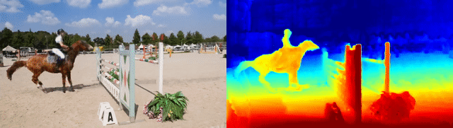
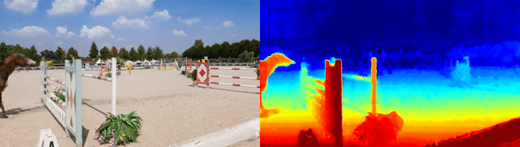
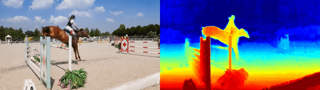
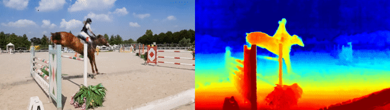

# Robust Dynamic Radiance Fields

Dynamic radiance field reconstruction methods aim to model the time-varying structure and appearance of a dynamic scene. Existing methods, however, assume that accurate camera poses can be reliably estimated by Structure from Motion (SfM) algorithms. These methods, thus, are unreliable as SfM algorithms often fail or produce erroneous poses on challenging videos with highly dynamic objects, poorly textured surfaces, and rotating camera motion. We address this robustness issue by jointly estimating the static and dynamic radiance fields along with the camera parameters (poses and focal length). We demonstrate the robustness of our approach via extensive quantitative and qualitative experiments. Our results show favorable performance over the state-of-the-art dynamic view synthesis methods.

### [Project page](https://robust-dynrf.github.io/) | [arXiv](https://arxiv.org/abs/2301.02239) | [Video](https://www.youtube.com/watch?v=38S56ottFQ4) | [Supp](https://openaccess.thecvf.com/content/CVPR2023/supplemental/Liu_Robust_Dynamic_Radiance_CVPR_2023_supplemental.pdf) | [Evaluation Results](https://drive.google.com/file/d/1GzO2AEWE2azibt3XtriOHdRFj3LFPTa6/view?usp=share_link)

> **Robust Dynamic Radiance Fields**<br>
> [Yu-Lun Liu](https://www.cmlab.csie.ntu.edu.tw/~yulunliu), 
[Chen Gao](http://chengao.vision), 
[Andreas Meuleman](https://ameuleman.github.io), 
[Hung-Yu Tseng](https://hytseng0509.github.io/), 
[Ayush Saraf](https://scholar.google.com/citations?user=bluhHm8AAAAJ&hl=en), 
[Changil Kim](https://changilkim.com), 
[Yung-Yu Chuang](https://www.csie.ntu.edu.tw/~cyy/), 
[Johannes Kopf](http://johanneskopf.de),
[Jia-Bin Huang](https://jbhuang0604.github.io) <br>
in CVPR 2023 <br>

## Setup
Tested with PyTorch 2.0 and CUDA 11.7.
```
git clone --recursive https://github.com/facebookresearch/robust-dynrf
cd robust-dynrf
conda create -n RoDynRF python=3.8 -y
conda activate RoDynRF
pip install torch torchvision
pip install tqdm scikit-image opencv-python configargparse lpips imageio-ffmpeg kornia lpips tensorboard imageio easydict matplotlib scipy plyfile timm
```

## Dataset
```
mkdir dataset
cd dataset
```

### [Nvidia](https://gorokee.github.io/jsyoon/dynamic_synth/)
Download the pre-processed data by [DynamicNeRF](https://github.com/gaochen315/DynamicNeRF).
```
mkdir Nvidia
wget --no-check-certificate https://filebox.ece.vt.edu/~chengao/free-view-video/data.zip
unzip data.zip
rm data.zip
```

### [DAVIS](https://davischallenge.org/davis2016/code.html) or custom sequences
Put the images in the following data structure.
```
RoDynRF                
├── dataset
│   ├── DAVIS_480p
│   │   ├── bear
│   │   │   └── images
│   │   │       ├── 00000.jpg
│   │   │       ├── 00001.jpg
│   │   │       ├── ...
│   │   │       └── 00081.jpg
│   │   ├── blackswan
│   │   ├── ...
│   │   └── train
│   ├── custom
│   │   ├── sequence_000
│   │   │   └── images
│   │   │       ├── 00000.jpg
│   │   │       ├── 00001.jpg
│   │   │       ├── ...
```
Run the following preprocessing steps.

## Preprocessing

Assume image files are in `${SCENE_DIR}/images`.

Download DPT and RAFT pretrained weights.
```
mkdir weights
cd weights
wget https://github.com/intel-isl/DPT/releases/download/1_0/dpt_large-midas-2f21e586.pt
wget https://www.dropbox.com/s/4j4z58wuv8o0mfz/models.zip
unzip models.zip
cd ..
```

Estimate monocular depth.
```
python scripts/generate_DPT.py --dataset_path ${SCENE_DIR} --model weights/dpt_large-midas-2f21e586.pt
```

Predict optical flows.
```
python scripts/generate_flow.py --dataset_path ${SCENE_DIR} --model weights/raft-things.pth
```

Obtain motion mask.
```
python scripts/generate_mask.py --dataset_path ${SCENE_DIR}
```

## Training
Set the `expname` in `conifig/${CONFIG_FILE}` with `${EXP_NAME}`.
Adjust the `N_voxel_t` in `conifig/${CONFIG_FILE}` to match the number of images in `${SCENE_DIR}/images`.
```
python train.py --config configs/${CONFIG_FILE}

# Train the Nvidia dataset
python train.py --config configs/Nvidia.txt

# Train the Nvidia dataset without poses
python train.py --config configs/Nvidia_no_poses.txt

# Train the DAVIS or custom dataset without poses
python train.py --config configs/DAVIS.txt
```
After training completion, checkpoints `${EXP_NAME}.th` and `${EXP_NAME}_static.th`, and reconstruction results will be stored in `log/${EXP_NAME}`. 
In `${SCENE_DIR}`, we also store `poses_bounds_RoDynRF.npy`, which has the same format as `poses_bounds.npy` in the original NeRF.

## Rendering
```
python train.py --config configs/${CONFIG_FILE} --ckpt log/${EXP_NAME}/${EXP_NAME}.th --render_only 1 --render_path 1
```
This will render the following video results for both RGB and depth.
- recon: training sequence reconstruction


- fix_view: change time + fix view


- change_view_time: change time + spiral view


- dolly: fix time + dolly zoom


- zoom: fix time + zoom-in


- spiral: fix time + spiral view


## Evaluation
Please download the results of our method and the compared methods and evaluation scripts.
```
https://drive.google.com/file/d/1GzO2AEWE2azibt3XtriOHdRFj3LFPTa6/view?usp=share_link
```

## Contact
For any questions related to our paper and implementation, please email yulunliu@cs.nycu.edu.tw.

## Citation
```
@inproceedings{liu2023robust,
  author    = {Liu, Yu-Lun and Gao, Chen and Meuleman, Andreas and Tseng, Hung-Yu and Saraf, Ayush and Kim, Changil and Chuang, Yung-Yu and Kopf, Johannes and Huang, Jia-Bin},
  title     = {Robust Dynamic Radiance Fields},
  booktitle = {Proceedings of the IEEE/CVF Conference on Computer Vision and Pattern Recognition},
  year      = {2023}
}
```

## Acknowledgements
The code is available under the MIT license and draws from [TensoRF](https://github.com/apchenstu/TensoRF), [DynamicNeRF](https://github.com/gaochen315/DynamicNeRF), and [BARF](https://github.com/chenhsuanlin/bundle-adjusting-NeRF), which are also licensed under the MIT license.
Licenses for these projects can be found in the `licenses/` folder.

We use [RAFT](https://github.com/princeton-vl/RAFT) and [DPT](https://github.com/isl-org/DPT) for flow and monocular depth prior.
